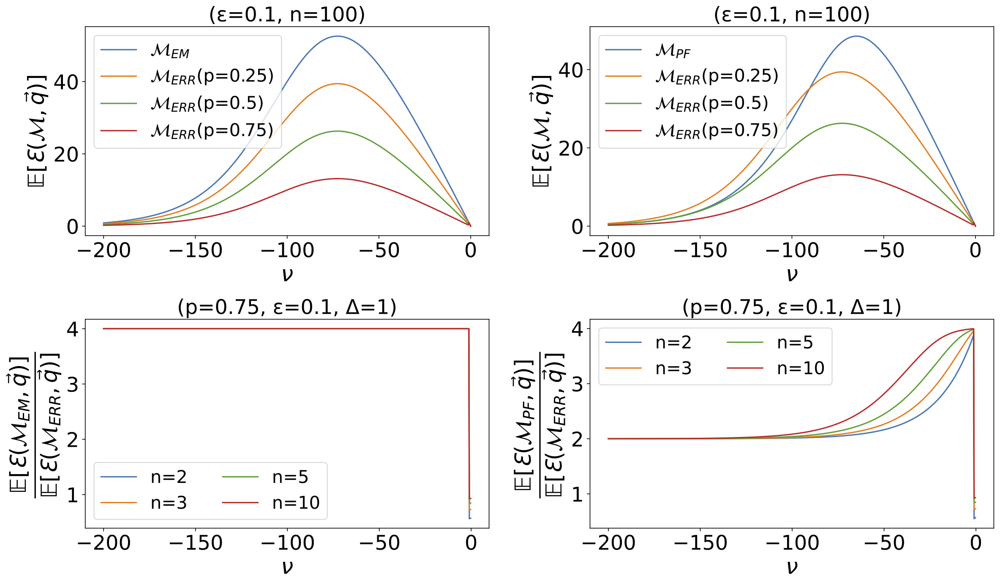
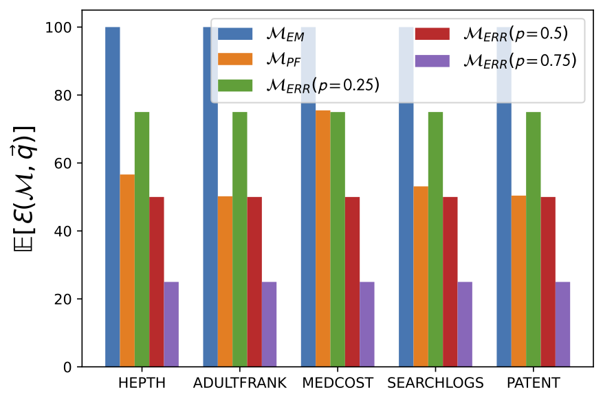
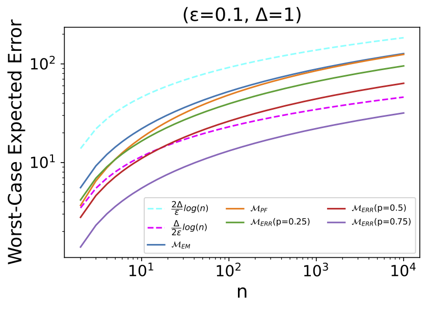

# Exponential Randomized Response 
### Combining the Exponential Mechanism and Randomized Response to Increase Utility in Differentially Private Selection
### This repository contains the code to reproduce the publication "---".

## Contents

[Experiments](https://github.com/gonzalo-munillag/Exponential_Randomised_Response/tree/main/Experiments): Folder containing all the empirical comparisons between mechanisms.  
[differential-privacy-library-main](https://github.com/gonzalo-munillag/Exponential_Randomised_Response/tree/main/differential-privacy-library-main): Folder containing the diffprivlib library from IBM ([Original here](https://github.com/IBM/differential-privacy-library)) with the addition of the Exponential Randomised Response mechanism. 

The code of the Exponential Randomised Response mechanism can be specifically found [here](https://github.com/gonzalo-munillag/Exponential_Randomised_Response/blob/0155ffea84110c2c02841f070bdb5379381b2cb7/differential-privacy-library-main/diffprivlib/mechanisms/exponential.py#L194).

## Acknowledgement

I would like to thank Ryan McKenna for kindly providing the codebase of his mechanism [permute-and-flip](https://crossminds.ai/video/permute-and-flip-a-new-mechanism-for-differentially-private-selection-606fe85ff43a7f2f827c0a45/) and for kindly answering questions about his mechanism.

## Setup

1) In the terminal, go to the differential-privacy-library-main folder and install my modified version of diffprivlib (the modification is the addition of the novel mechanism that I present in the aforementioned paper):

$ pip install .

2) In a .py executable or Jupyter Notebook cell import the exponential mechanism functionality

from diffprivlib.mechanisms import exponential

3) To use the novel method, call:

 exponential.EnhancedRandomizedResponse(...)
 
## Reproduce the paper

All the code to reproduce the figures of the paper is in the folder [Experiments](https://github.com/gonzalo-munillag/Exponential_Randomised_Response/tree/main/Experiments).

These are some of the figures you may find.

